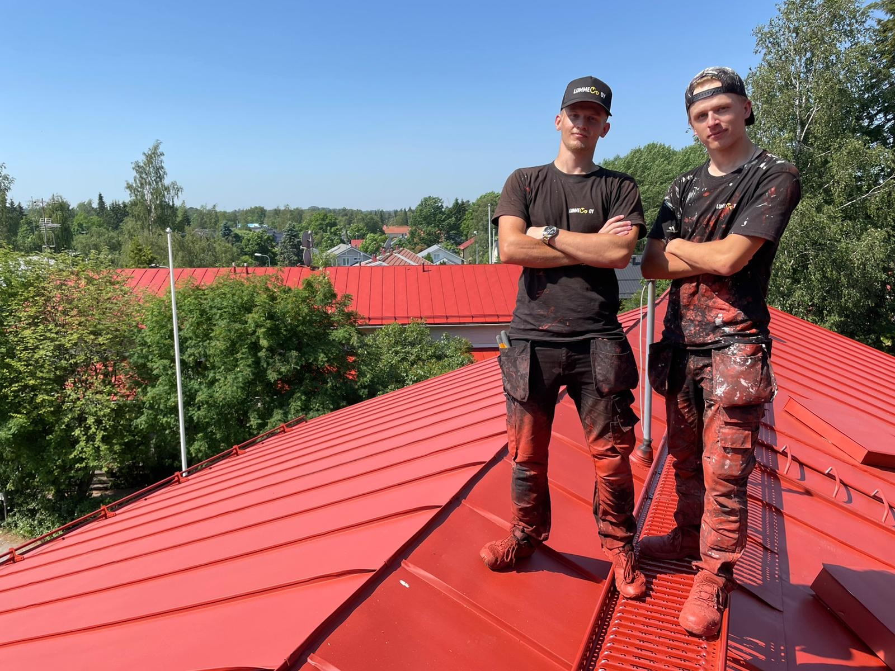
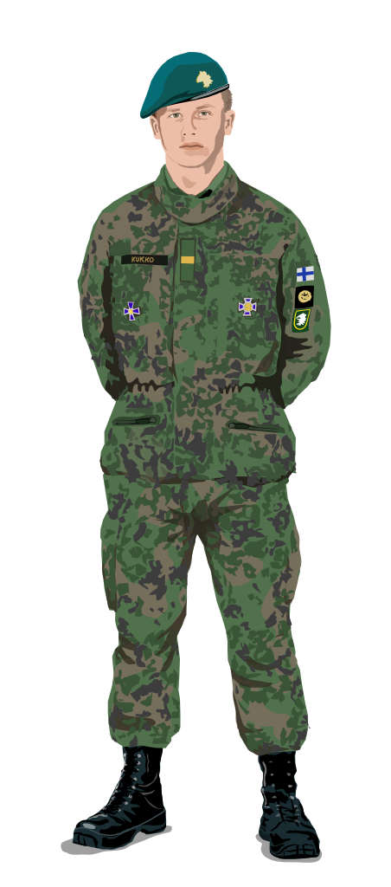
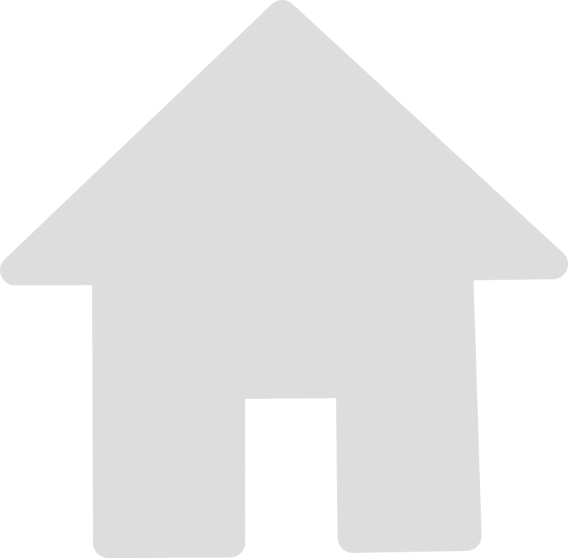

# Sisältö projektiin
Tähän repositorioon on koottu sisältö Web- ja mobiilikäyttöliittymät -kurssin projektityötä varten.
Alla on listattuna projektin ensimmäisen palautukseen sisällöltä vaadittuja asioita.

## Kuvaileva johdanto/esittely asiaan:
  (Itse sivulle kirjoitettava vai tähän palautukseen tarkoitettu?) Tämä sivusto on tarkoitettu omaksi kotisivukseni, johon kokoan mm. esittelyn itsestäni, CV:n, projekteja ja tuottamaani taidetta. Itseni lisäksi sivustoa saattavat tarkastella ystävät ja mahdolliset työntarjoajat.
  

## Esitelty sisältö/asia jakautuu vähintään 3 alateemaan/aiheeseen (ts. 1+3 kokonaisuutta)
Etusivu sisältää yleisen esittelyn itsestäni. Etusivulla on myös kuvattuna ajantasainen opiskelu-/työtilanne ja mahdolliset innostuksen aiheet.
  - Ensimmäinen alasivu koostuu työnhakuun tarkoitetusta kokonaisuudesta. Tässä alateemassa on CV ladattavassa muodossa, mutta myös työ- ja opiskeluhistoriani kuvattuna hiukan tarkemmin. Kirjoitan tänne myös omia ajatuksiani ja kommentteja eri vaiheista opiskelussa ja työssä.
  - Toinen alasivu on tarkoitettu taidesisällön jakamiseen. Tänne lisään mm. luomaani vektoritaidetta ja kirjoitan ajatuksia teoksista.
  - Kolmas alasivu on tarkoitettu ohjelmointiin liittyvien projektien jakamiseen. 

## Vähintään 1 koko selainnäkymän täyttävä taustakuva

## Vähintään yksi iso kuva, joka täyttää n. 60-90% ruudun kuvapinta-alasta, kun selainikkuna täyttää koko ruudun

## Vähintään 1 pienempi kuva, joka täyttää n. 10-30% ruudun kuvapinta-alasta, kun selainikkuna täyttää koko ruudun

## Vähintään 1 pieni kuva, jota toimii kuvallisena linkkinä

## PALJON TEKSTIÄ!!! Tekstin voit tuottaa itse. Jos hyödynnät tekoälyä tai muiden tuottamaa tekstiä, mainitse lähteet. Toinen vaihtoehto: tee aiheeseen liittyvää tekstiä ensimmäinen kappale/sivu, mutta muuten tekstimassaa voi tuottaa käyttämällä Lorem Ipsum..-täytetekstiä.
Hei!

Olen Veikka Kukko. Olet löytänyt kotisivuni. Tältä sivustolta voit löytää minusta tietoa työnhakuun liittyen, sisältöä tekemistäni ohjelmointiprojekteista ja tuottamaani grafiikkataidetta. 
- Jos olet työnantaja, löydät työnhakuun liittyvää tietoa välilehdeltä **Työ ja opinnot**.
- Ohjelmointiprojektejani löydät välilehdeltä **Ohjelmointiprojektit**.
- Taidetta löydät välilehdeltä **Vektoritaidetta**. 

Olet tällä hetkellä etusivulla. Etusivu sisältää yleisen esittelyn minusta.

Lorem ipsum dolor sit amet, consectetur adipiscing elit. Nullam sit amet mauris est. Integer vitae ante luctus, molestie urna non, mattis mauris. Integer porta at neque at varius. Phasellus ut augue vestibulum libero tincidunt tempus finibus id sem. Ut eu nulla pharetra, luctus justo quis, tincidunt sem. Phasellus cursus, nunc vitae sollicitudin fringilla, lacus quam pretium purus, eget efficitur turpis odio eget ex. Quisque quis lectus pharetra, facilisis magna cursus, vestibulum metus. Nam mollis nulla eu sollicitudin aliquet.

Praesent viverra auctor fermentum. Nullam faucibus vulputate quam vel vestibulum. Quisque hendrerit turpis eget leo placerat, et tempor risus venenatis. Vivamus mollis ornare efficitur. Cras ex metus, tempor non tincidunt in, porta sed elit. Proin nec purus eu velit efficitur vehicula a ut nunc. Curabitur sagittis porta est faucibus aliquam. Fusce scelerisque nulla non augue luctus malesuada at id massa. Maecenas nisi lectus, eleifend at nibh viverra, feugiat semper elit. Maecenas faucibus est nec tortor pretium cursus nec vel magna.

Sed ultrices tincidunt lectus id tristique. Vivamus blandit vehicula leo sed auctor. Praesent imperdiet fermentum nisl ac vestibulum. Aliquam ante ipsum, mattis sit amet pulvinar eget, vestibulum a nisi. Morbi id metus lobortis, rutrum arcu at, faucibus massa. Suspendisse cursus aliquet faucibus. Nulla nec neque bibendum, egestas odio non, lobortis mauris. Interdum et malesuada fames ac ante ipsum primis in faucibus. Maecenas sed porttitor lacus. Etiam eget felis eu turpis consectetur dapibus id vitae massa. Nulla tempus pellentesque finibus.

Quisque ligula neque, consequat viverra maximus a, tincidunt bibendum ex. Morbi nec neque molestie, fringilla nisl ac, semper eros. Nam eget urna vel purus condimentum sodales in in nisl. Praesent pretium eros at nisl imperdiet dictum id sit amet lectus. Vestibulum venenatis elit vel aliquet faucibus. Nunc blandit nibh vel ante sodales, nec blandit nisi pharetra. Donec dignissim interdum massa, quis sagittis magna molestie eget. In hac habitasse platea dictumst. Phasellus molestie mi ipsum, eu malesuada erat dignissim sit amet. Nullam commodo purus vitae turpis pulvinar sodales. Donec tincidunt turpis id nisl commodo, vitae sodales libero suscipit. Maecenas imperdiet suscipit orci sed luctus. Cras maximus, mi eu aliquam iaculis, nunc sapien convallis metus, sit amet interdum libero dui a nibh.

Donec hendrerit a mi sed pretium. Curabitur convallis posuere ex, sit amet facilisis leo bibendum vitae. Phasellus pellentesque gravida neque a lobortis. Curabitur ut urna quis urna finibus consectetur. Integer placerat maximus ligula eget tempus. Morbi et justo feugiat, sodales odio non, fermentum risus. Praesent elit nunc, fermentum et lorem eget, ornare dignissim libero. Nullam sit amet odio risus. Nam placerat libero eget eleifend dapibus.

## yhteystiedot (oikeat tai fiktiiviset)
Veikka Kukko
0440153888
veikka.kukko@gmail.com

## tekstien ja kuvien lisäksi jotain muuta sisältöä: vaihtoehtoja esim. multimediaelementit (videot, äänitallenteet ), vuorovaikutukselliset elementit (lomakkeet, kyselyt, upotetut kartat)

YouTube-videon upotus sivulle:

